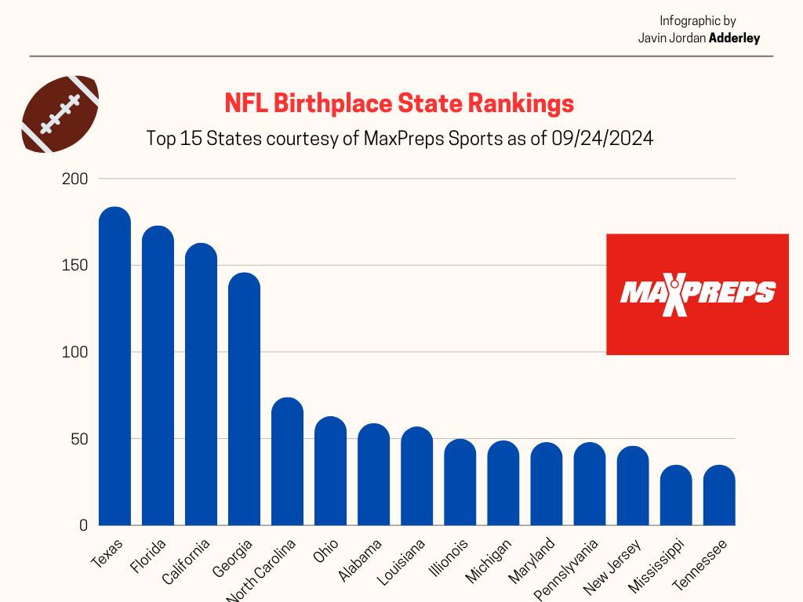

# jordanadd4.github.io
## Self Introduction
I am a student-athlete at Lehigh University, a senior football player majoring in Journalism and minoring in Religious Studies & Jewish Studies.
[Javin Jordan Adderley Website](https://sites.google.com/lehigh.edu/javinjadderley/home)

### Infographic of Lehigh Location Demographic 
An infographic of the population demographic of Lehigh University. This [Full Lehigh Demographic Statistic Sheet](https://data.lehigh.edu/university-profile#:~:text=Lehigh%20University%20Profile%3A-,Fall%202024,-Fall%202023) discusses the diffreernt percentages of Lehigh students seperated by race and ethnicity. 
.jpg) 

### NFL Player Birthplace Dataset
This dataset is a look at the rankings of the top states in America when it comes to having players drafted into the NFL. The top 15 states were selected, and liseted in order from least to greatest. There are currently 1,696 players in the NFL, and this list makes up 1,230 of those players. This data comes from [MaxPreps](https://www.maxpreps.com/news/MII7xF0_6ESRnaewgE616g/2024-nfl-week-1-rosters-texas-high-schools-lead-state-by-state-breakdown-with-184-former-players-in-the-league.htm)

.png)
## The Rivalry

<iframe src='https://cdn.knightlab.com/libs/timeline3/latest/embed/index.html?source=1k4x8TnJKyVDHwbwJiDUInDD_o4rDDMgs6GqSIJ3ptL8&font=Default&lang=en&initial_zoom=2&height=650' width='100%' height='650' webkitallowfullscreen mozallowfullscreen allowfullscreen frameborder='0'></iframe>

## The Rise of the Braves in the 2020s
Timeline of the Atlanta Braves baseball team from 2013-2024. This timeline goes through the fall and then rise of the franchise into the 2020, including their 2021 World Series Championship. This info was acquired from the [MLB's Postseason History](https://www.mlb.com/braves/history/postseason-results)

<iframe src='https://cdn.knightlab.com/libs/timeline3/latest/embed/index.html?source=1QjP3RRqdV4oxMCerLUEGPEL07RlVxG-GzKb1_CF1MUk&font=Default&lang=en&initial_zoom=2&height=650' width='100%' height='650' webkitallowfullscreen mozallowfullscreen allowfullscreen frameborder='0'></iframe>

## Lehigh University Student Profile Bar Chart
In class activity of student population by college, made with ChartBuilder. Information recieved from [Lehigh University Office of Instutional Data](https://data.lehigh.edu/sites/data.lehigh.edu/files/LUprofile_2024.pdf)

## Percentages of African-American Representation in the NBA in 2023
A graph made getting a percentage of every African-American person's role in the NBA. This graph shows out of 100%, what percentage of African-American people make up this role. This data was acquired from [Statista](https://www.statista.com/statistics/1154720/nba-ethnic-diversity/)
.png) 

# Top 2019 Cycling Cities
In class startup to work on Google Maps of the top cycling cities in the world in 2019 via The Wired Magazine

<iframe src="https://www.google.com/maps/d/u/0/embed?mid=1L_0O5FqlL0DWx9By7eh7w1WIS5qZaz8&ehbc=2E312F" width="640" height="480"></iframe>
